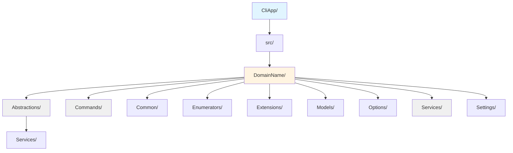
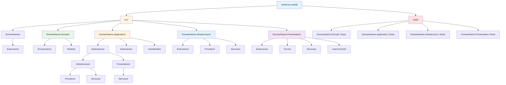
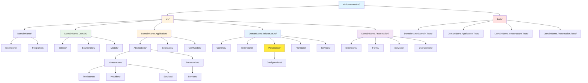
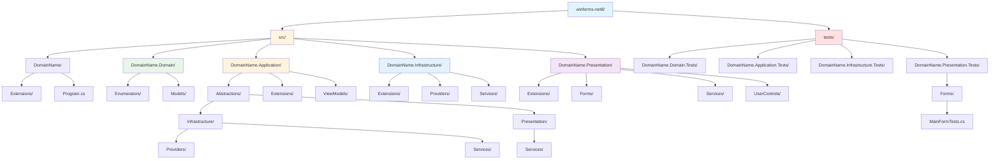
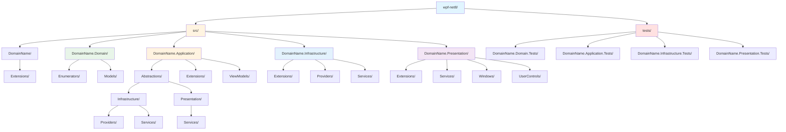
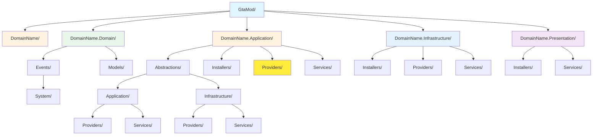

```mermaid
graph TD;
  A[wpf-net8-ef/] --> B[DomainName/];
  A --> C[DomainName.Domain/];
  A --> D[DomainName.Application/];
  A --> E[DomainName.Infrastructure/];
  A --> F[DomainName.Presentation/];
  A --> Z[tests/];

  B --> B1[Extensions/];

  C --> C1[Entities/];
  C --> C2[Enumerators/];
  C --> C3[Models/];

  D --> D1[Interfaces/];
  D1 --> D1A[Infrastructure/];
  D1A --> D1A1[Persistence/];
  D1A --> D1A2[Providers/];
  D1A --> D1A3[Services/];
  D1 --> D1B[Presentation/];
  D1B --> D1B1[Services/];
  D --> D2[Extensions/];
  D --> D3[ViewModels/];

  E --> E1[Common/];
  E --> E2[Extensions/];
  E --> E3[Persistence/];
  E3 --> E3B[Configurations/];
  E --> E4[Providers/];
  E --> E5[Services/];

  F --> F1[Extensions/];
  F --> F2[Services/];
  F --> F3[Windows/];
  F --> F4[UserControls/];

  Z --> Z1[DomainName.Domain.Tests/];
  Z --> Z2[DomainName.Application.Tests/];
  Z --> Z3[DomainName.Infrastructure.Tests/];
  Z3 --> Z3A[Installer/];
  Z --> Z4[DomainName.Presentation.Tests/];

style A fill:#e1f5ff
style B fill:#fff4e1
style C fill:#e8f5e9
style D fill:#fff3e0
style E fill:#e3f2fd
style F fill:#f3e5f5
style Z fill:#ffe1e1
style E3 fill:#ffeb3b
```

# Templates Repository

A comprehensive collection of .NET project templates designed for rapid application development with clean architecture principles, dependency injection, and modern .NET features.

## 📋 Overview

This repository contains production-ready project templates for various .NET application types. Each template follows best practices, implements dependency injection patterns, and uses a layered architecture approach for maintainability and scalability.

## 🚀 Available Templates

### 1. CLI Application (`CliApp`)

A command-line interface application template built with .NET, utilizing **Spectre.Console** for rich console output and command handling.

#### Features

- Command-based architecture using Spectre.Console.Cli
- Dependency injection with Microsoft.Extensions.DependencyInjection
- Options pattern for configuration management
- Structured logging with ILoggerService
- Weather forecast sample command implementation

#### Project Structure



#### Key Components

- **Commands**: Executable CLI commands (e.g., `WeatherForecastCommand`)
- **Services**: Business logic implementation with DI support
- **Options Pattern**: Type-safe configuration binding
- **TypeRegistrar**: Custom type registrar for Spectre.Console DI integration

---

### 2. WinForms .NET Framework 4.8 (`winforms-net48`)

A Windows Forms application template targeting .NET Framework 4.8 with clean architecture layers.

#### Features

- Multi-layered architecture (Domain, Application, Infrastructure, Presentation)
- Generic Host implementation for WinForms
- Dependency injection throughout the application
- Configuration management with appsettings.json
- Comprehensive logging infrastructure
- Unit testing with MSTest

#### Project Structure



#### Architecture Layers

1. **Domain**: Core business entities, models, and domain logic
2. **Application**: Application services, abstractions, and view models
3. **Infrastructure**: External concerns (file I/O, logging, system services)
4. **Presentation**: WinForms UI components, forms, and user controls

---

### 3. WinForms .NET 8 (`winforms-net8`)

Modern Windows Forms application template targeting .NET 8 with enhanced features.

#### Features

- .NET 8 runtime with latest C# features
- Clean architecture with clear separation of concerns
- Modern dependency injection patterns
- IHostBuilder integration for WinForms
- File and directory provider abstractions
- Navigation service for form management
- User service for system information
- Comprehensive unit testing suite

#### Project Structure



#### Key Services

- **IDirectoryProvider**: Directory operations abstraction
- **IFileProvider**: File system operations
- **ILoggerService<T>**: Generic logging service
- **INavigationService**: Form navigation management
- **IUserService**: User and machine information

---

### 4. WinForms .NET 8 with Entity Framework (`winforms-net8-ef`)

Extended WinForms template with Entity Framework Core integration for database operations.

#### Features

- All features from winforms-net8
- Entity Framework Core with SQLite
- Database context abstraction (IDatabaseContext)
- Migration support
- Automatic database creation on startup
- Connection string configuration
- Development and production environment configurations

#### Project Structure



#### Database Configuration

- **Provider**: SQLite (configurable)
- **Migrations**: Stored in Infrastructure assembly
- **Lifetime**: Singleton by default
- **Features**:
  - Sensitive data logging (Development only)
  - Detailed errors
  - Command timeout configuration
  - Query logging

---

### 5. WPF .NET 8 (`wpf-net8`)

Modern Windows Presentation Foundation application template with MVVM pattern support.

#### Features

- WPF with .NET 8
- MVVM architecture support
- Dependency injection for ViewModels and Windows
- IHost integration with WPF Application lifecycle
- Dispatcher-aware exception handling
- Modern UI capabilities

#### Project Structure



#### Key Features

- **App.xaml.cs**: Application entry point with host configuration
- **MainWindow**: Primary application window with DI
- **Graceful shutdown**: Proper host disposal on application exit
- **Unhandled exception handling**: Centralized error handling

---

### 6. WPF .NET 8 with Entity Framework (`wpf-net8-ef`)

WPF template with Entity Framework Core for data-driven applications.

#### Features

- All features from wpf-net8
- Entity Framework Core integration
- Database-first or code-first approaches
- Repository pattern support
- Async data operations

#### Project Structure



---

### 7. GTA Modification (`GtaMod`)

A specialized template for creating Grand Theft Auto V script modifications using ScriptHookVDotNet.

#### Features

- ScriptHookVDotNet integration
- Event-driven architecture
- Game provider abstractions
- Audio and screen providers
- World interaction providers
- Clean architecture for game mods

#### Project Structure



#### Key Components

- **StartUp**: Main script class inheriting from GTA.Script
- **Event System**:
  - TickEvent (game loop)
  - KeyDownEvent / KeyUpEvent (input handling)
  - AbortedEvent (script termination)
- **Providers**:
  - IAudioProvider: Sound and music control
  - IGameProvider: Game state and player information
  - IScreenProvider: Screen effects and UI
  - IWorldProvider: World manipulation

#### Dependencies

- GTA V with ScriptHookV
- ScriptHookVDotNet
- .NET Framework or .NET 6+

---

### Dependency Injection

All templates use Microsoft.Extensions.DependencyInjection for service registration:

```csharp
services.RegisterServices(context.Configuration, context.HostingEnvironment);
```

### Service Registration Pattern

Each layer has its own `ServiceCollectionExtensions` class:

- `RegisterServices`: Register layer-specific services
- `RegisterViewModels`: Register ViewModels (UI layers)
- `RegisterProviders`: Register provider implementations

### Configuration Management

Templates use the Options pattern with `appsettings.json`:

```csharp
hostBuilder.RegisterAppSettingsConfiguration()
```

### Logging Infrastructure

Generic logging service available across all templates:

```csharp
ILoggerService<T> // Generic strongly-typed logger
```

### Abstractions Pattern

Each layer defines abstractions (interfaces) consumed by other layers:

- `Abstractions/Infrastructure/`: Infrastructure interfaces
- `Abstractions/Application/`: Application service interfaces
- `Abstractions/Presentation/`: UI service interfaces

---

## 🧪 Testing Strategy

All desktop application templates include comprehensive test projects:

### Test Structure

### Testing Framework

- **MSTest**: Primary testing framework
- **Moq**: Mocking library for dependencies
- **Unit Tests**: Isolated component testing
- **Integration Tests**: Cross-layer testing (where applicable)

---

## 📦 Common Dependencies

### All Templates

- Microsoft.Extensions.DependencyInjection
- Microsoft.Extensions.Hosting
- Microsoft.Extensions.Logging
- Microsoft.Extensions.Configuration

### Desktop Applications (WinForms/WPF)

- Microsoft.Extensions.Configuration.Json
- Microsoft.Extensions.Logging.Console
- Microsoft.Extensions.Logging.Debug

### Entity Framework Templates

- Microsoft.EntityFrameworkCore
- Microsoft.EntityFrameworkCore.Sqlite
- Microsoft.EntityFrameworkCore.Design

### CLI Application

- Spectre.Console
- Spectre.Console.Cli

### GTA Modification

- ScriptHookVDotNet

---

## 🛠️ Usage

### Using Templates

1. **Clone the repository:**

```pwsh
git clone https://github.com/BoBoBaSs84/Templates.git
```

2. **Choose your template** and copy the desired template folder

3. **Rename the namespace:**

- Replace `DomainName` with your actual domain/project name across all files
- Update project references and namespaces

4. **Configure:**

- Update `appsettings.json` (if applicable)
- Configure connection strings (EF templates)
- Set up project-specific configurations

5. **Build and run:**

```pwsh
dotnet build dotnet run
```

### Creating .NET Templates (Optional)

To install as dotnet templates:

1. Create a `template.json` file in each template's `.template.config` folder
2. Install template:

```pwsh
dotnet new install ./[TemplatePath]
```

---

## 📚 Best Practices Implemented

### Clean Architecture

- **Dependency Rule**: Dependencies point inward (Presentation → Application → Domain)
- **Separation of Concerns**: Each layer has distinct responsibilities
- **Testability**: Loose coupling enables comprehensive testing

### SOLID Principles

- **Single Responsibility**: Classes have one reason to change
- **Open/Closed**: Open for extension, closed for modification
- **Liskov Substitution**: Abstractions are properly implemented
- **Interface Segregation**: Focused, client-specific interfaces
- **Dependency Inversion**: Depend on abstractions, not concretions

### Design Patterns

- **Repository Pattern** (EF templates)
- **Options Pattern** (configuration)
- **Factory Pattern** (service creation)
- **Provider Pattern** (infrastructure abstractions)
- **MVVM Pattern** (WPF templates)

---

## 🔧 Configuration Examples

### appsettings.json (Desktop Applications)

```json
{
  "Logging": {
    "LogLevel": {
      "Default": "Information",
      "Microsoft": "Warning"
    }
  },
  "ConnectionStrings": {
    "DefaultConnection": "Data Source=app.db"
  }
}
```

### Program.cs (Entry Point Pattern)

```csharp
IHost host = Host.CreateDefaultBuilder(args)
  .RegisterAppSettingsConfiguration()
  .ConfigureServices((context, services)
    => services.RegisterServices(context.Configuration, context.HostingEnvironment))
  .Build();

host.Run();
```

---

## 🤝 Contributing

Contributions are welcome! To contribute:

1. Fork the repository
2. Create a feature branch (`git checkout -b feature/AmazingFeature`)
3. Commit your changes (`git commit -m 'Add some AmazingFeature'`)
4. Push to the branch (`git push origin feature/AmazingFeature`)
5. Open a Pull Request

---

## 📄 License

This project is licensed under the MIT License - see the repository for details.

---

## 👤 Author

**BoBoBaSs84**

- GitHub: [@BoBoBaSs84](https://github.com/BoBoBaSs84)

---

## 🔄 Version History

- **Latest**: Includes .NET 8 templates with modern features
- **Legacy Support**: .NET Framework 4.8 templates maintained

---

## 📞 Support

For issues, questions, or suggestions:

- Open an issue on GitHub
- Check existing documentation in template folders
- Review sample implementations in each template

---

## 🎯 Roadmap

Future template additions may include:

- ASP.NET Core Web API template
- Blazor application template
- MAUI cross-platform template
- Microservices template with Docker support

---

_Last Updated: November 2025_
